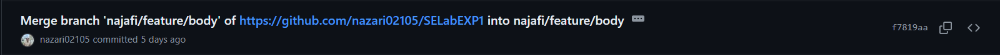
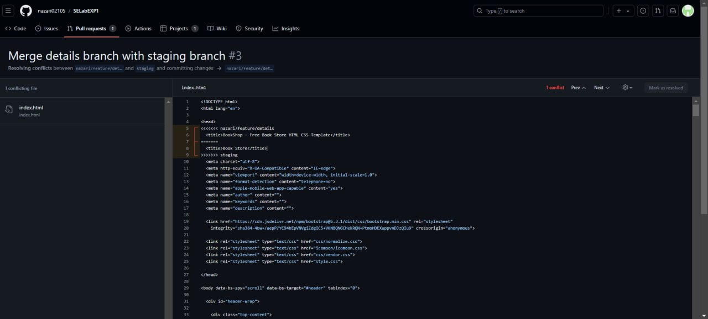
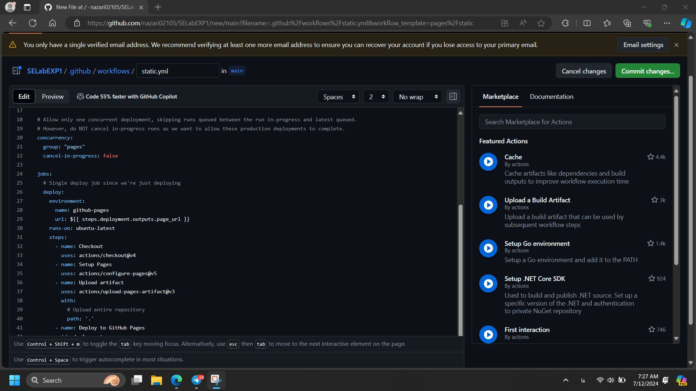

# SELabEXP1
| نام          | شماره دانشجویی|
| ------------- | ------------- |
| علیرضا عالیپناه                  | 99106396      |
| سیدمحمدیوسف نجفی      | 99102361      |
| علی نظری                        | 99102401      |

# کامیت‌ها و شاخه‌ها
در گام اول این آزمایش یک پروژه
static 
را باید انتخاب می‌کردیم تا آن را تیکه تیکه جلو ببریم و 
commit 
کنیم و در نهایت همان رو 
deploy 
کنیم به کمک
github actions.

پروژه‌ای که انتخاب کردیم یک سایت فروش کتاب بود و هر کس بخشی از آن را 
costumize 
کرد و پوش کرد. برای پوش کردن هم اول از همه اینکه دسترسی پوش مستقیم به 
main 
را بستیم و یک شاخه
staging 
ایجاد کردیم و از همان 
staging 
هم تعدادی زیادی شاخه ایجاد کردیم که هر کدام برای کار و شخص خاصی بود و برای نامگذاری‌ها هم چه برای شاخه و چه برای 
commit
از اصول نامگذاری خواسته شده استفاده کردیم.

در انتها وضعیت شاخه‌های ایجاد شده به شکل زیر شد:

<p align="center">
  
</p>

همانطور که گفته شد برای نامگذاری شاخه‌ها از فرمت گفته شده پیروی کردیم و نخست اسم کسی که روی آن بخش کار می‌کند را گذاشتیم و سپس اینکه 
چه حالتی دارد که بیشتر وقت‌ها 
feature 
بود و بعد هم اون 
feature
که در حال پیاده‌سازی شدن در آن شاخه بود.

درون هر کدام از شاخه‌ها هم کامیت‌های مربوط به همان 
feature
است که در زیر تعدادی از آنها را مشاهده می‌کنید:

<p align="center">
  
</p>

<p align="center">
  
</p>

<p align="center">
  
</p>

اگر در صفحه گیتهاب هم مشاهده بفرمایید، در مجموع 37 
commit 
را ثبت کردیم که بسیاری از آنها با معنی بودند و همچنین از 
branch
هایی متعددی هم استفاده کردیم.

در دستور کار گفته شده بود که از فایل
gitignore
هم استفاده کنیم که استفاده کردیم و آن فایل به شکل زیر است:

[.gitignore](.gitignore)

# کانفلیکت‌ها
حال به بحث 
confilict
ها می‌رسیم که قرار بود هر دو نوع 
conflict
موجود را از عمد مواجه شویم. برای حالت اول روی یکی از 
branch
ها دو نفرمان همزمان 
pull 
کردیم و تغییرات خود را اعمال کردیم و روی یک فایل واحد هم برخی تغییرات را اعمال کردیم و سپس یک نفر
push
کرد و حال نفر دوم که می‌خواست 
push 
کند، واضحا 
conflict 
خورد که در عکس زیر 
commit
و جزئیات آن را مشاهده می‌فرمایید:

<p align="center">
  
</p>

<p align="center">
  
</p>

که همانطور که مشخص است دو نفر همزمان روی یک فایل
normalize.css
تغییراتی ایجاد کرده‌اند که 
conflict
خورده ولی بعدا رفع شده است.

نکته بسیار مهم بعدی این است که ما به شکل مستقیم روی 
staging
و 
main 
هیچ 
push
ای انجام ندادیم و فقط با 
pull request
این کار را انجام دادیم که در زیر تعدادی از نمونه‌های آن را می‌بینید:

<p align="center">
  
</p>

<p align="center">
  
</p>

همچنین در زیر تعدادی از 
merge
های انجام شده را مشاهده می‌فرمایید:

<p align="center">
  
</p>

<p align="center">
  
</p>

حال نوع دیگر 
conflict
که ممکن است، این است که دو نفر روی 
branch
های مختلفی کار کنند و یک فایل واحد را تغییر دهند و سپس یکی زودتر 
merge
کند با 
branch
پایه و سپس نفر بعدی بخواهد 
merge 
کند که در این شرایط مشکل پیش می‌آید و باید حل شود که در زیر این حالت را بهش رسیدیم:

<p align="center">
  
</p>

در اینجا می‌بینیم که خود گیتهاب متوجه می‌شود که 
merge 
کردن ممکن نیست به خاطر تغییراتی که اعمال شده. 

<p align="center">
  
</p>

در عکس بالا هم می‌بینیم که باید 
conflict 
را 
resolve 
کنیم و در عکس پایین هم حالت 
resolve
شده را می‌بینیم:

<p align="center">
  
</p>

و بعد از اینکار، دیگر اروری برای
merge 
کردن به ما داده نمی‌شود و این موضوع حل می‌شود:

<p align="center">
  
</p>

# ایجاد محدودیت روی شاخه اصلی
در اول کار نیاز بود که شاخه 
main 
را محدود کنیم تا نتوان به شکل مستقیم به آن چیزی 
push
کرد و همه کارها از طریق 
PR 
قابل انجام باشد که در زیر مرحله‌های انجام آن را می‌بینیم:

<p align="center">
  
</p>

<p align="center">
  
</p>

<p align="center">
  
</p>

# کانبان
در این بخش همانطور که خواسته شده بود، سرگروه آزمایش تسک‌ها را وارد این برد می‌کرد و بر اساس اولویت موجود و اینکه 
چه کسی باید آن کارها را انجام دهد، تسک‌ها را ایجاد کردند و هر زمان هم که انجام می‌شدند، آنها را به بخش 
Done 
می‌بردند پس از بررسی.

فقط یک نکته خیلی مهم اینجا وجود دارد که چون ما از قالب آماده برای سایت فروش کتاب استفاده کردیم، فاصله بین
commit
ها و همچنین ایجاد تسک‌ها بسیار کوتاه است ولی واقعا هر زمانی که تسک می‌خواست ایجاد شود، آن تسک مربوطه در 
Kanban
ایجاد شد.

در زیر تعدادی از عکس‌های مربوطه را مشاهده می‌فرمایید:

<p align="center">
  
</p>

<p align="center">
  
</p>

<p align="center">
  
</p>

# استقرار مستمر
در این بخش همانطور که گفته شده بود باید از 
github actions
استفاده میکردیم تا شاخه 
main
خود را دیپلوی کنیم و استقرار مستمر را هم باید داشته باشیم که هر تغییری ایجاد شد روی 
main
خود به خود دیپلوی هم بشود. برای اینجام اینکار نخست در تنظیمات باید حالت
actions
را فعال می‌کردیم:

<p align="center">
  
</p>

سپس به ترتیب مرحله‌های زیر را می‌رویم تا بتوانیم سایت استاتیک خود را دیپلوی کنیم:

<p align="center">
  
</p>

<p align="center">
  
</p>

<p align="center">
  
</p>

و در نهایت در 
[این لینک](https://nazari02105.github.io/SELabEXP1/)
دیپلوی شد که خروجی هم در عکس زیر قابل مشاهده است:

<p align="center">
  
</p>

# پاسخ به پرسش ها
1.پوشه‌ی .git یک پوشه مخفی در ریشه‌ی یک پروژه گیت است که شامل تمامی اطلاعات مربوط به ریپازیتوری گیت می‌باشد. این پوشه شامل تاریخچه تغییرات، پیکربندی‌های ریپازیتوری، اطلاعات شاخه‌ها، برچسب‌ها، و سایر داده‌های مرتبط با پروژه است.

اطلاعات ذخیره‌شده در پوشه‌ی .git
شاخه‌ها (Branches): اطلاعات مربوط به شاخه‌های مختلف پروژه.
شیء‌ها (Objects): شامل اشیاء گیت مانند commit‌ها، tree‌ها، و blob‌ها.
شاخص (Index): یک فایل موقت برای مدیریت تغییرات پیش از commit شدن.
پیکربندی (Config): تنظیمات و پیکربندی‌های ریپازیتوری.

دستور ساخت پوشه ی گیت:
```
git init
```
<b></b>
2.منظور از atomic بودن این است که عملیات یا به طور کامل انجام می‌شود یا اصلاً انجام نمی‌شود:

Atomic Commit: یک commit که تمامی تغییرات را یکجا اعمال می‌کند.
Atomic Pull-Request: یک pull request که تمامی تغییرات پیشنهادی را یکجا اعمال می‌کند.
<b></b>
